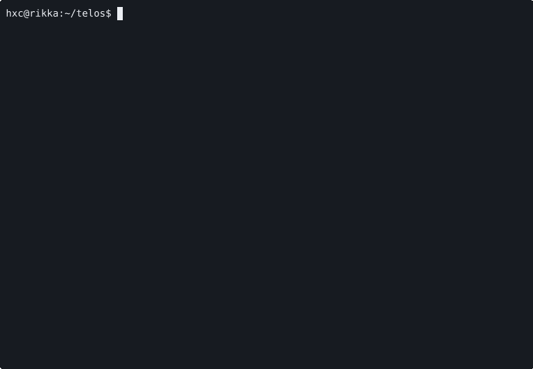
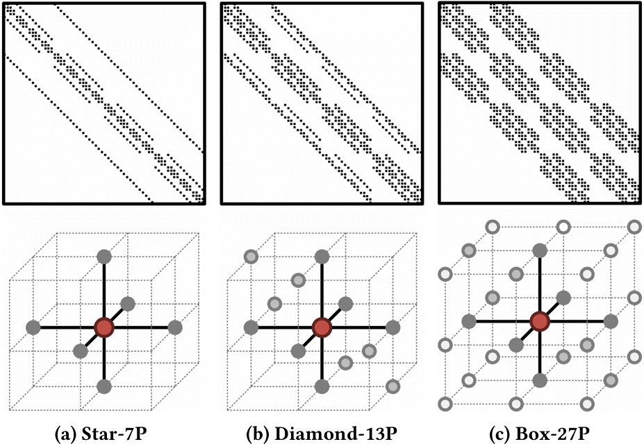

# Telos
This repository contains the cycle-accurate simulator for the accelerator proposed in the paper
*Telos: A Dataflow Accelerator for Sparse Triangular Solver of Partial Differential Equations (ISCA'25).*

# Overview
PDEs often result in large, sparse systems of linear equations, where SpTRSV dominates computation time due to its loop-carried dependencies. Telos leverages the structured sparsity patterns inherent in PDE solving to achieve high performance by:

- Exploiting stencil-based sparsity patterns to maximize pipeline parallelism.
- Introducing a plane-parallel pipelining technique for efficient mapping of computations onto PEs.
- Employing a cross-plane communication aggregation technique to optimize data transfers.
- Overlapping computations with memory accesses for improved efficiency.

# Requirements
Our simulator is implemented based on [SimPy](https://simpy.readthedocs.io/en/latest/), a process-based discrete-event simulation framework for Python. Before proceeding, ensure that you install the required package by running the following command:

```
pip install -r requirements.txt
```

# Getting Started

The simulator's entry point is the `main.py` file. Use the following command to run the simulator:
```
python main.py [config_file] [size] [debug_flag]
```
For example, you can test the default configuration with a 64x64 grid size as follows:
```
python main.py cfg/config_base.json 64 64
```


You can also enable debug mode by passing an additional parameter (any value). This mode generates trace files in the log directory, providing detailed information about the hardware execution.
The configuration file `cfg/config_base.json` defines the number of dimensions (`NumDim`) and the stencil type (`StencilType`) to be used for solving PDEs.
The following stencil patterns are supported:



The top and bottom parts show the sparsity pattern of matrix A and its associated stencil. These three stencils, Star-7P, Diamond-13P, and Box-27P, are labeled as 0, 1, and 2, respectively. The `sim/matrix_gen.py` file is responsible for generating sparse matrices based on the specified type.


We provide regression tests to verify the correctness of the simulator for both SpMV and SpTRSV across various configurations:
```
python test.py [spmv | sptrsv]
```

To reproduce our experimental results, execute the following command:
```
python exp.py [csv_path] [exp_type] [max_procs]
```
For example, our SpTRSV latency experiment can be performed using:
```
python exp.py result.csv sptrsv 16
```
This command generates the `result.csv` file for the `sptrsv` evaluation using `16` concurrent processes. A complete list of supported experiments can be found in the `exp.py` file.

# Citation
> Xiaochen Hao, Hao Luo, Chu Wang, Chao Yang, and Yun Liang. 2025. Telos:
A Dataflow Accelerator for Sparse Triangular Solver of Partial Differential
Equations. In Proceedings of the 52nd Annual International Symposium on
Computer Architecture (ISCA ’25), June 21–25, 2025, Tokyo, Japan. ACM, New
York, NY, USA, 14 pages. https://doi.org/10.1145/3695053.3731078