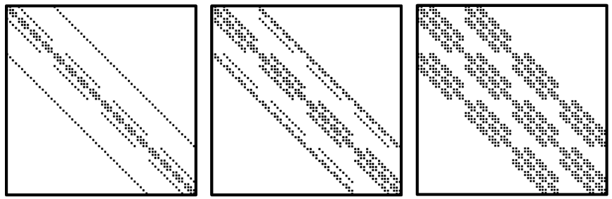

# Telos



*Figure: Typical matrix sparsity patterns in solving PDEs*

# Introduction
Partial Differential Equations (PDEs) are the backbone of numerous scientific problems. Their solutions typically require numerical methods, which convert these equations into large, sparse systems of linear equations. These systems, solved with iterative methods, reveal structured sparsity patterns when derived from stencil-based numerical schemes. In preconditioned solvers, the sparse triangular solve procedure, SpTRSV, usually dominates the entire execution due to its loop-carried dependencies. Optimizing SpTRSV requires extracting parallelism from dependent computations. However, prior works fail to achieve both data locality and high parallelism, resulting in suboptimal performance.  

We propose Telos, a dataflow accelerator for SpTRSV that exploits structured sparsity patterns in PDE solving. The dataflow execution effectively utilizes pipeline parallelism to exploit the PDE-derived stencil patterns. We address the challenge of complex data dependencies by employing a plane-parallel pipelining technique to parallelize and map computations onto PEs. A cross-plane communication aggregation technique streamlines data transfers into a systolic style. Our accelerator architecture features deep pipelining of dependent computations and substantial data reuse within and across PEs. Experiments demonstrate that Telos achieves average speedups of 61X, 11X, 8X, and 11X over PETSc (CPU), cuSPARSE(GPU), AG-SpTRSV (GPU), and Alrescha (accelerator), respectively.

# Usage
To run the simulator, if the problem size is 2D
```
python main.py test.json x y
```
if the problem size is 3D
```
python main.py test.json x y z
```

To test the correctness of simulator of SpMV and SpTRSV
```
python test.py [spmv | sptrsv]
```

To get experiment data with given sizes and stencil types
```
python exp.py [data_csv_path] [spmv | sptrsv | ...] [max_procs]
```

# Publication
+ **Telos: A Dataflow Accelerator for Sparse Triangular Solver of Partial Differential Equations**.  
Xiaochen Hao, Hao Luo, Chu Wang, Chao Yang, Yun Liang. ISCA, 2025. 
